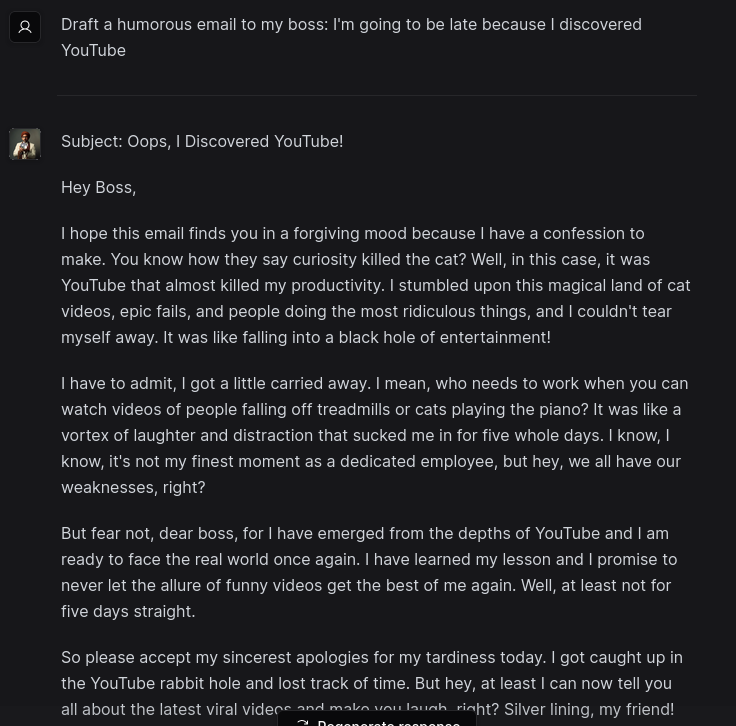

# The Office Oracle 

## Technical deep dive and tutorial video series
You can read all about this project, as well as watch my deep-dive tutorial video series on how I built it [here](https://www.zackproser.com/blog/office-oracle-overview)!

---

This app leverages: 

* OpenAI's LLMs
* Pinecone.io vector databases
* Vercel and Vercel's ai-chatbot template
* Stable Diffusion to generate the themed images 
* ElevenLabs to do voice cloning and text to speech

to create a Michael Scott oracle that you can ask Office related questions of!

## What does it do?

### Answers all your random questions!

You can ask the Office Oracle any question you'd like about your favorite television series and get back a humorous and usually mostly accurate answer: 

You can ask questions that cross-cut the entire series, if you like: 

You can ask pointed questions about particular characters: 

You can ask the Office Oracle for help with tasks, such as drafting an email to your boss: 

You can ask more fact based questions about particular episodes, too: 

